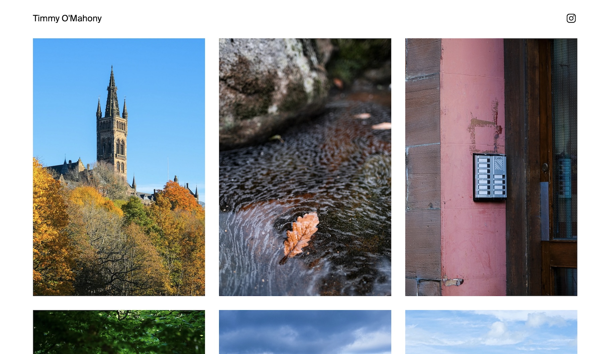

# Next.js Photo Blog

An opinionated static photo blog using [Next.js 13](https://nextjs.org/). You can see the photo blog in action at [https://photos.timmyomahony.com](https://photos.timmyomahony.com).



If you're interested in running this codebase for yourself, make sure to look through the rest of the readme or [this blog post](https://timmyomahony.com/blog/creating-a-static-next-13-photo-blog/) to get an idea of the (opinionated) approach.

## Requirements

- Node 18
- An S3 or Digital Ocean Spaces account

## Setup

Clone the repo and install dependencies with:

```bash
npm install
```

Make sure to add the required environment variables to `.env.local`:

```env
AWS_ENDPOINT=https://ams3.digitaloceanspaces.com
AWS_REGION=ams3
AWS_BUCKET=timmyomahony-photos
AWS_ACCESS_KEY_ID=
AWS_SECRET=
AWS_SECRET_ACCESS_KEY=https://timmyomahony-photos.ams3.digitaloceanspaces.com/
```

Run it:

```bash
npm run dev
```

## Background

The goal of this project was to make a photo blog that:

1. Had as few moving parts as possible.
2. Made publishing as painless and friction-free as possible.

## Workflow

With that in mind, this codebase is opinionated and rigid in how it works to suit my requirements. The publishing workflow is intended to be a single step: export images to a folder and let automation handle the rest:


- There are no databases, APIs, servers etc. Everything is static.
- OS automation is used to prepare and upload images to S3 (I'm using MacOS and Hazel).
- Images are storage on S3/DO spaces with a specific folder structure.
- Each folder of images is an "album".
- The folder name contains the date which is used for sorting.
- EXIF metadata is used for image titles, captions, tags etc.

### OS Automation

In order to make publishing as painfree as possible, I use [Hazel](https://www.noodlesoft.com/) on MacOS to automate the preparation and upload of photos to storage.

It works like this:

- I export photos from Lightroom CC at full quality and size to a predefined folder (e.g. `Export`)
- Hazel detects when images are added to this folder and a script `./bin/hazel/process_images.sh` is run each image.
- This script will:
  - Resize the image.
  - Reduce its quality for the web.
  - Create a thumnbail automatically (this will be moved to the codebase in the future)
  - Upload the images to storage.

Photos processed by this script are stored on S3 with the following folder structure:

```sh
/2022-11-15/Name of First Album/Image-01.jpeg
/2022-11-15/Name of First Album/Image-02.jpeg
/2022-11-15/Name of First Album/Image-03.jpeg
/2022-11-15/Name of Second Album/Image-01.jpeg
/2022-11-15/Name of Second Album/Image-02.jpeg
/2022-11-15/Name of Second Album/Image-03.jpeg
...
```

The folder structure is used to extract both the date of the photo album and the name of the photo album.

Exif metadata is extracted for each photo: the title, caption and tags for example.

### Additional data

You can retrospectively add a `data.json` to each album folder, which will be called during builds for additional data belonging to the album. Currenty it's limited to:

```json
{
  "description": "A short description of this album."
}
```

## Roadmap

- [ ] Automate the creation of thumbnails via Next.js metadata/og API.
- [ ] Figure out to automate new builds when all images are exported (this is a shortcoming of Hazel).
